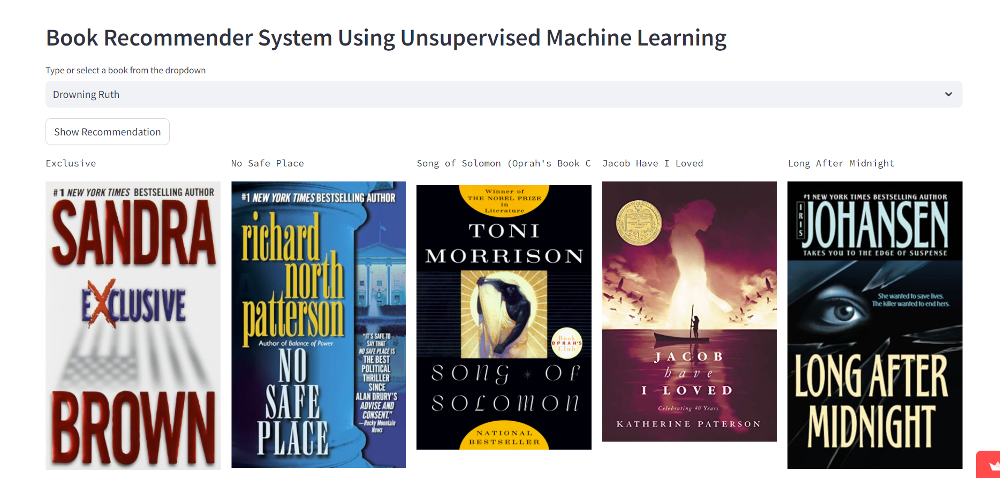
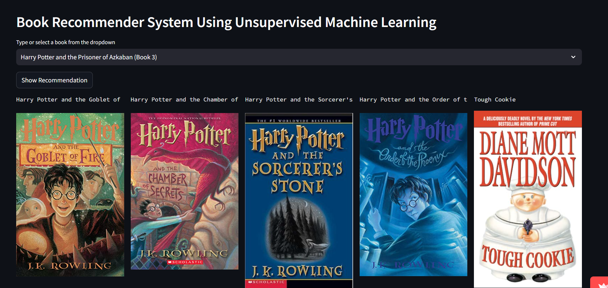
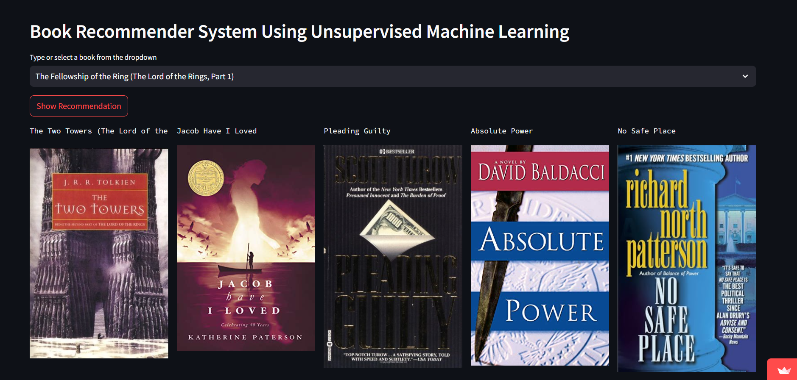

# 📚 Book Recommendation System Using Unsupervised Machine Learning

This project implements a Book Recommendation System using unsupervised machine learning techniques. It recommends books based on collaborative and content-based filtering methods and displays book covers and other relevant details in a user-friendly web app powered by **Streamlit**.

## 🔍 Features

- **Collaborative Filtering**: Recommends books based on the user's reading history and ratings given by others with similar preferences.
- **Content-Based Filtering**: Recommends books based on genre and book features.
- **Book Posters**: Fetches and displays the cover images of recommended books.
- **Interactive User Interface**: Select a book and get recommendations directly via a web interface.

---

## 🚀 Live Demo

You can see the live demo of this project on Streamlit- [Book Recommendation System](https://diva-book-recommender.streamlit.app/)

---

## 📂 Project Structure

```bash
.
├── Pickle/                  # Directory for model and data pickle files
│   ├── model.pkl            # Pre-trained model for collaborative filtering
│   ├── book_names.pkl       # List of book titles
│   ├── final_rating.pkl     # Data containing ratings and image URLs
│   ├── book_pivot.pkl       # Pivot table for collaborative filtering
│   ├── final_rating_compressed.bz2 # Compressed final_rating.pkl
└── app.py                   # Main Streamlit app
└── README.md                # Project documentation
└── requirements.txt         # Python dependencies
```

---

## 📦 Installation

To run the Book Recommendation System locally, follow these steps:

1. **Clone the repository**:

```bash
git clone https://github.com/GuptaDiva/book-recommendation-system.git
cd book-recommendation-system
```

2. **Create a virtual environment** (optional but recommended):

```bash
python -m venv env
source env/bin/activate  # For Linux/Mac
# OR
envScriptsactivate     # For Windows
```

3. **Install the required dependencies**:

```bash
pip install -r requirements.txt
```

4. **Download the required Pickle files**:

Ensure you have the following files in the `Pickle/` directory:
- `model.pkl`
- `book_names.pkl`
- `final_rating.pkl` (or `final_rating_compressed.bz2`)
- `book_pivot.pkl`

Alternatively, you can compress the large pickle file for memory optimization:

```bash
pip install compress-pickle
python -c "import compress_pickle as cpickle; cpickle.dump(final_rating, 'Picklec/final_rating_compressed.bz2', compression='bz2')"
```

5. **Run the Streamlit app**:

```bash
streamlit run app.py
```

6. **Access the web app**:

Open your browser and go to `http://localhost:8501/` to interact with the book recommendation system.

---

## 🧠 Model Description

The recommendation system is built using two methods:

1. **Collaborative Filtering**: We use k-nearest neighbors (k-NN) to find books similar to the ones the user likes, based on user interactions and ratings.
   
2. **Content-Based Filtering**: Recommends books based on the genre and features of other books, and displays similar books in terms of content.

---

## 📊 Dataset

- **Books**: A dataset containing book titles, authors, genres, and cover images.
- **Ratings**: A dataset with user ratings for various books.
  
The datasets are preprocessed and saved as pickle files (`.pkl`) for fast loading during app execution.

---

## 💻 Technologies Used

- **Python**: Programming language for developing the recommendation system.
- **Streamlit**: A Python framework for creating the web interface.
- **scikit-learn**: Machine learning library used for k-NN (Collaborative Filtering).
- **Pandas**: Data manipulation library.
- **Numpy**: For numerical operations.
- **Pickle**: For serializing and saving machine learning models and data.
- **Compress-Pickle**: For compressing large `.pkl` files using `bz2` to optimize memory.

---

## 📖 Usage Instructions

- **Select a book**: Choose a book from the dropdown menu.
- **View Recommendations**: After clicking on "Show Recommendation", a list of recommended books along with their cover images will appear.
- **Switch between filters**: The app will automatically handle collaborative filtering and content-based filtering based on the availability of the selected book.

---

## 📝 License

This project is licensed under the **GPLv2** - see the [LICENSE](LICENSE) file for details.

---

## 🤝 Contributing

Feel free to open an issue or submit a pull request if you would like to contribute to this project. Contributions are welcome!

---

## 👨‍💻 Author

- **Diva Gupta** - [GitHub](https://github.com/GuptaDiva)

If you have any questions, feel free to reach out!

---

## 📬 Acknowledgments

- **Streamlit** for making data apps easy to build and deploy.

---

### 📷 Screenshots





---

### Notes
- For some of the searches, the name of the book is displayed but no image is there, its because the dataset was a little outdated and some of these images don't exist anymore.


